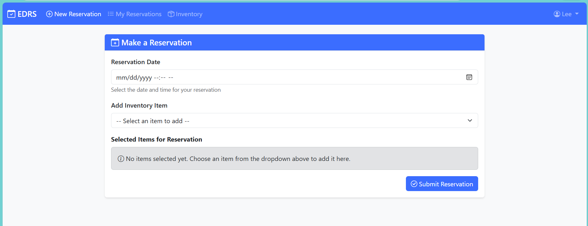
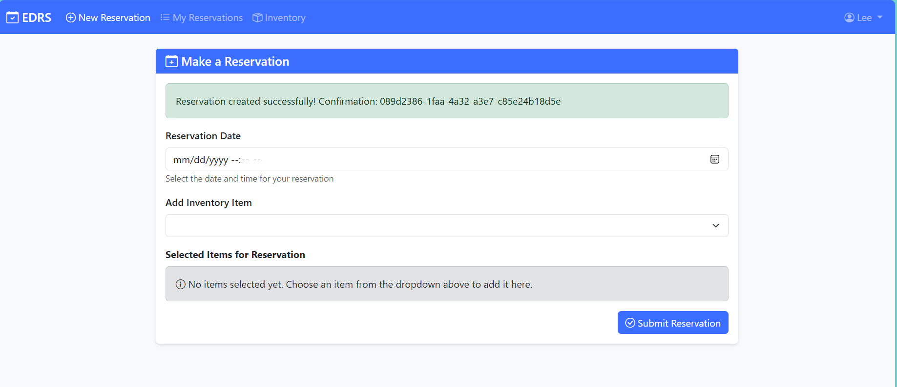
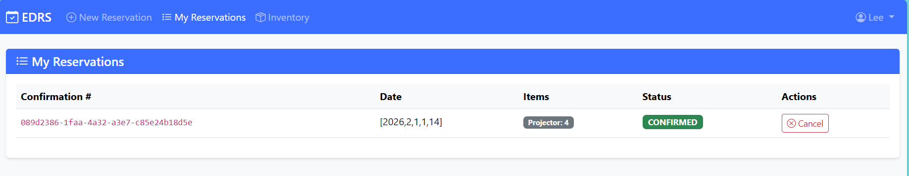
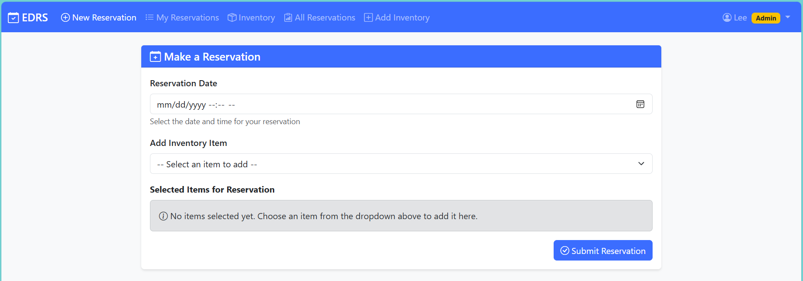

# EDRS - Event-Driven Reservation System

## Overview

EDRS is a microservices-based reservation system built with Spring Boot, Kafka, and PostgreSQL. The system is designed to handle reservations for inventory items through an event-driven architecture using the choreography pattern.

**Key Features:**
- ✅ Event-driven microservices architecture
- ✅ Docker Compose deployment (one command to start everything)
- ✅ **Web UI** - Single-page AngularJS application with Bootstrap (http://localhost:8000)
- ✅ **Quantity-based reservations** - Reserve multiple units per item
- ✅ **Effective availability calculation** - Accounts for reserved quantities
- ✅ Bulk CSV inventory import
- ✅ Distributed tracing with OpenTelemetry and Jaeger
- ✅ HikariCP connection pooling with metrics
- ✅ Event sourcing and idempotency
- ✅ Centralized Swagger UI for all APIs
- ✅ Automated rebuild scripts for clean deployments

## Architecture

The system consists of five microservices and a web UI:

1. **Web UI** (Port 8000)
   - Single-page AngularJS application with Bootstrap
   - User-friendly interface for making reservations and managing inventory
   - Features: Login, Make Reservations, View Reservations, Inventory Management
   - Admin features: View all reservations, Add inventory items
   - See [web-ui/README.md](web-ui/README.md) for details

2. **Reservation Service** (Port 8080)
   - REST API for creating and managing reservations
   - Swagger UI available at `/swagger-ui.html`
   - Publishes reservation and cancellation requests to Kafka

3. **Inventory Service** (Port 8081)
   - REST API for managing inventory items
   - **Bulk CSV import** for inventory (POST `/api/inventory/receive/bulk`)
   - **Effective availability calculation** (GET `/api/inventory/{id}/availability`)
   - Swagger UI available at `/swagger-ui.html`
   - Publishes inventory receive events to Kafka
   - Queries persistence service for reservation quantities

4. **Notification Service** (Port 8082)
   - Listens for reservation and cancellation events
   - Sends mock email notifications (ready for integration with email service)

5. **Logging Service** (Port 8083)
   - Logs all events with correlation IDs for tracing
   - Provides visibility into system activity

6. **Persistence Service** (Port 8084)
   - Handles all database operations
   - Listens to events and persists data to PostgreSQL
   - Publishes confirmation events

## Technology Stack

- **Java 17**
- **Spring Boot 3.2.0**
- **Spring Kafka 3.1.1**
- **Apache Kafka 4.0.0** (Client library)
- **MyBatis 3.0.3** (Database persistence)
- **HikariCP** (Connection pooling)
- **PostgreSQL 42.7.1**
- **Maven** (Multi-module project)
- **Swagger/OpenAPI** for API documentation
- **OpenTelemetry 1.32.0** (Distributed tracing and metrics)
- **Docker & Docker Compose** (Containerization)
- **AngularJS 1.8.3** (Web UI framework)
- **Bootstrap 5.3.0** (UI styling)
- **Nginx** (Web server for UI)

## Prerequisites

**For Docker deployment (Recommended):**
- Docker 20.10+ and Docker Compose 2.0+
- At least 4GB of available RAM
- Ports 8000 (Web UI), 8080-8090, 5433 (PostgreSQL), 9094 (Kafka broker), 9095 (Kafka controller), 16686, 4317-4318 available

**For local development:**
- Java 17 or higher
- Maven 3.6+
- PostgreSQL (for production) or H2 (for testing)
- Kafka (for production) or embedded Kafka (for testing)

## Quick Start with Docker

The easiest way to get started is using Docker Compose:

```bash
# Build and start all services (including Kafka and PostgreSQL)
docker-compose up -d --build

# View logs
docker-compose logs -f

# Check service status
docker-compose ps
```

This will start:
- **Web UI** (http://localhost:8000) - AngularJS single-page application
- All 5 microservices
- PostgreSQL database
- Kafka with KRaft (no Zookeeper required)
- Jaeger for distributed tracing
- OpenTelemetry Collector
- Kafka UI for topic management
- **Centralized Swagger UI** (aggregates all service APIs)
- **Dozzle** - Docker log viewer with web UI (http://localhost:9999)

See [DOCKER.md](DOCKER.md) for detailed Docker deployment instructions.

## Local Development Setup

### 1. Build the Project

```bash
mvn clean install
```

### 2. Configure Environment Variables

For local development without Kafka/PostgreSQL, the services will attempt to connect to:
- Kafka: `localhost:9094` (external access, services inside Docker use `kafka:29092`)
   - Note: Default port is 9094 to avoid conflicts with host Kafka. Override with `KAFKA_PORT` environment variable.
- PostgreSQL: `localhost:5433` (database: `edrs`, user: `postgres`, password: `postgres`)
   - Note: Default port is 5433 to avoid conflicts with host PostgreSQL. Override with `POSTGRES_PORT` environment variable.

You can override these using environment variables:
- `KAFKA_BOOTSTRAP_SERVERS` - Kafka bootstrap servers
- `DATABASE_URL` - PostgreSQL connection URL
- `DATABASE_USERNAME` - PostgreSQL username
- `DATABASE_PASSWORD` - PostgreSQL password

### 3. Start Services

Each service can be started independently:

```bash
# Terminal 1 - Reservation Service
cd reservation-service
mvn spring-boot:run

# Terminal 2 - Inventory Service
cd inventory-service
mvn spring-boot:run

# Terminal 3 - Notification Service
cd notification-service
mvn spring-boot:run

# Terminal 4 - Logging Service
cd logging-service
mvn spring-boot:run

# Terminal 5 - Persistence Service
cd persistence-service
mvn spring-boot:run
```

Or build and run from the root:

```bash
mvn spring-boot:run -pl reservation-service
mvn spring-boot:run -pl inventory-service
mvn spring-boot:run -pl notification-service
mvn spring-boot:run -pl logging-service
mvn spring-boot:run -pl persistence-service
```

## API Endpoints

### Reservation Service (http://localhost:8080)

- `POST /api/reservations` - Create a reservation with quantities
  - Request body: `{"userId": "user1", "inventoryItemQuantities": {"item1": 2, "item2": 1}, "reservationDate": "2026-02-15T10:00:00Z"}`
- `GET /api/reservations` - List all reservations (optional `?userId=user1` filter)
- `GET /api/reservations/{confirmationNumber}` - Get reservation details
- `POST /api/reservations/{confirmationNumber}/cancel` - Cancel a reservation
- `GET /swagger-ui.html` - Swagger UI

### Inventory Service (http://localhost:8081)

- `GET /api/inventory` - List inventory items (supports filtering)
- `GET /api/inventory/{id}` - Get inventory item details
- `POST /api/inventory` - Add/create a new inventory item
- `GET /api/inventory/{id}/availability?date={isoDateTime}` - Get effective available quantity (accounts for reservations)
- `POST /api/inventory/receive` - Receive inventory
- `POST /api/inventory/receive/bulk` - **Bulk import inventory from CSV file**
- `GET /swagger-ui.html` - Swagger UI

See [BULK_IMPORT.md](docs/BULK_IMPORT.md) for CSV format and usage details.

## Web UI

The system includes a modern web-based user interface accessible at **http://localhost:8000**.

### Features

- **Login** - Simple authentication (stub implementation, any username works)
- **Make Reservations** - Create reservations with:
  - Inventory item selection from dropdown
  - Date and time picker
  - Quantity selection for each item
  - **Effective availability display** - Shows available quantity accounting for existing reservations
- **My Reservations** - View and cancel your own reservations
- **Inventory List** - Browse all available inventory items
- **Admin Features** (for users with usernames starting with "admin"):
  - View all reservations from all users
  - Add new inventory items

### Usage

The Web UI is automatically started with Docker Compose. Simply navigate to http://localhost:8000 in your browser after starting the services.

For more details, see [web-ui/README.md](web-ui/README.md).

### Screenshots

#### Login Screen

The login page with simple authentication. Any username works (stub implementation).

#### Make a Reservation

Create a new reservation by selecting inventory items, choosing a date/time, and specifying quantities. The form shows effective availability that accounts for existing reservations.

#### Reservation Submitted

Confirmation screen after successfully submitting a reservation.

#### My Reservations

View all your reservations with the ability to cancel active ones. Shows item names, dates, and status.

#### Inventory List

Browse all available inventory items. The "Available Quantity" column shows effective availability (accounting for all active reservations), with total inventory shown in parentheses when different.

#### Admin View

Admin users (usernames starting with "admin") see additional navigation options: "All Reservations" to view reservations from all users, and "Add Inventory" to create new inventory items.

## Event Flow

1. **Reservation Request Flow:**
   - User creates reservation via Reservation Service API with quantities (e.g., `{"item1": 2, "item2": 1}`)
   - Reservation Service publishes `reservation-requested` event with quantities
   - Persistence Service checks inventory availability for requested items, quantities, and date
   - If available: Persistence Service stores reservation with quantities and publishes `reservation-created` event
   - If unavailable: Persistence Service publishes `reservation-failed` event
   - Notification Service sends confirmation email (on success) or failure notification
   - Reservation Service updates local cache (on success)
   - Logging Service logs all events

2. **Cancellation Flow:**
   - User cancels reservation via Reservation Service API
   - Reservation Service publishes `cancellation-requested` event
   - Persistence Service updates reservation status
   - Persistence Service publishes `cancellation-successful` event
   - Notification Service sends cancellation email
   - Reservation Service updates local cache
   - Logging Service logs all events

3. **Inventory Receive Flow:**
   - Admin receives inventory via Inventory Service API
   - **Bulk import**: Upload CSV file via `/api/inventory/receive/bulk` endpoint
   - Inventory Service publishes `inventory-received` event
   - Persistence Service updates inventory quantities
   - Logging Service logs the event

4. **Reservation Failure Flow:**
   - User creates reservation via Reservation Service API
   - Reservation Service publishes `reservation-requested` event
   - Persistence Service checks inventory availability
   - If unavailable, Persistence Service publishes `reservation-failed` event
   - Logging Service logs the failure event

## Testing

### Unit Tests

Run tests for all modules:

```bash
mvn test
```

### Integration Tests

For local testing without Kafka/PostgreSQL, services use:
- Embedded Kafka (via Spring Kafka Test)
- H2 in-memory database (for Persistence Service tests)

Test configurations are in `application-test.yml` files.

## Kafka Topics

The system uses the following Kafka topics:

**Producer Topics:**
- `reservation-requested` - Reservation creation requests (produced by Reservation Service)
- `cancellation-requested` - Cancellation requests (produced by Reservation Service)
- `inventory-received` - Inventory receive events (produced by Inventory Service)

**Consumer Topics:**
- `reservation-created` - Successful reservation creation (produced by Persistence Service)
- `reservation-failed` - Failed reservation attempts due to unavailability (produced by Persistence Service)
- `cancellation-successful` - Successful cancellations (produced by Persistence Service)

**Consumer Groups:**
- `reservation-service-group` - Consumes reservation-created, cancellation-successful
- `persistence-service-group` - Consumes reservation-requested, cancellation-requested, inventory-received
- `notification-service-group` - Consumes reservation-created, cancellation-successful
- `logging-service-group` - Consumes all topics for logging
- `inventory-service-group` - Consumes inventory-received (for cache updates)

## Database Schema

The Persistence Service uses **MyBatis** for database interactions with **HikariCP** connection pooling. The complete SQL schema is available in `persistence-service/src/main/resources/db/schema.sql`.

**Business Tables:**
- `reservations` - Stores reservation information
- `reservation_items` - Stores inventory items for each reservation with quantities (collection table)
  - Columns: `confirmation_number`, `inventory_item_id`, `quantity`
- `inventory_items` - Stores inventory item details and available quantities

**Event Sourcing & Idempotency Tables:**
- `event_log` - Event sourcing table tracking all processed events with full payload
- `processed_events` - Idempotency table tracking unique event IDs to prevent duplicate processing

**Schema Management:**
- The schema SQL file (`schema.sql`) contains all CREATE TABLE statements, indexes, and constraints
- Tables are automatically created on startup via Spring Boot's `spring.sql.init.mode=always`
- For production, you can run the schema SQL manually or use a migration tool like Flyway/Liquibase
- Connection pooling is configured via HikariCP (see [HIKARICP_METRICS.md](docs/HIKARICP_METRICS.md))

## Correlation IDs

All events include correlation IDs for tracing requests across services. The Logging Service uses these to stitch together related events.

## Production Deployment

### Prerequisites

- **Kafka Cluster** (Apache Kafka 4.0.0+ with KRaft mode recommended)
  - KRaft mode eliminates Zookeeper dependency
  - At least 3 brokers recommended for production
  - Replication factor of 3 for topics
  - Minimum in-sync replicas of 2

- **PostgreSQL Database** (version 12+)
  - Dedicated database for the persistence service
  - Sufficient connection pool size

- **Java Runtime** (Java 17+)
- **Maven** (for building)

### 1. Build the Application

```bash
# Build all modules and create JAR files
mvn clean install -DskipTests

# Or build with tests
mvn clean install
```

The build will create JAR files in each service's `target/` directory:
- `reservation-service/target/reservation-service-1.0.0-SNAPSHOT.jar`
- `inventory-service/target/inventory-service-1.0.0-SNAPSHOT.jar`
- `notification-service/target/notification-service-1.0.0-SNAPSHOT.jar`
- `logging-service/target/logging-service-1.0.0-SNAPSHOT.jar`
- `persistence-service/target/persistence-service-1.0.0-SNAPSHOT.jar`

### 2. Set Up PostgreSQL Database

```sql
-- Connect to PostgreSQL as superuser
CREATE DATABASE edrs;

-- Create a dedicated user (optional but recommended)
CREATE USER edrs_user WITH PASSWORD 'your_secure_password';

-- Grant privileges
GRANT ALL PRIVILEGES ON DATABASE edrs TO edrs_user;

-- Connect to the edrs database
\c edrs

-- Grant schema privileges (if using a specific schema)
GRANT ALL ON SCHEMA public TO edrs_user;
```

The persistence service will automatically create all required tables on first startup using the SQL schema file (`persistence-service/src/main/resources/db/schema.sql`) via Spring Boot's `spring.sql.init.mode=always`.

### 3. Create Kafka Topics

Create all required Kafka topics with appropriate replication and partition settings:

```bash
# Set your Kafka broker addresses
export KAFKA_BOOTSTRAP_SERVERS="kafka-broker1:9092,kafka-broker2:9092,kafka-broker3:9092"

# Create topics with replication factor 3 and partition count based on expected load
kafka-topics.sh --create --bootstrap-server $KAFKA_BOOTSTRAP_SERVERS \
  --topic reservation-requested \
  --partitions 6 --replication-factor 3 \
  --config min.insync.replicas=2

kafka-topics.sh --create --bootstrap-server $KAFKA_BOOTSTRAP_SERVERS \
  --topic cancellation-requested \
  --partitions 6 --replication-factor 3 \
  --config min.insync.replicas=2

kafka-topics.sh --create --bootstrap-server $KAFKA_BOOTSTRAP_SERVERS \
  --topic inventory-received \
  --partitions 6 --replication-factor 3 \
  --config min.insync.replicas=2

kafka-topics.sh --create --bootstrap-server $KAFKA_BOOTSTRAP_SERVERS \
  --topic reservation-created \
  --partitions 6 --replication-factor 3 \
  --config min.insync.replicas=2

kafka-topics.sh --create --bootstrap-server $KAFKA_BOOTSTRAP_SERVERS \
  --topic reservation-failed \
  --partitions 6 --replication-factor 3 \
  --config min.insync.replicas=2

kafka-topics.sh --create --bootstrap-server $KAFKA_BOOTSTRAP_SERVERS \
  --topic cancellation-successful \
  --partitions 6 --replication-factor 3 \
  --config min.insync.replicas=2

# Verify topics were created
kafka-topics.sh --list --bootstrap-server $KAFKA_BOOTSTRAP_SERVERS
```

**Note:** Adjust partition counts based on your expected throughput. More partitions allow for better parallelism but also more overhead.

### 4. Configure Environment Variables

Each service can be configured using environment variables. Create environment-specific configuration files or set these in your deployment platform:

**Common Variables:**
```bash
# Kafka Configuration
export KAFKA_BOOTSTRAP_SERVERS="kafka-broker1:9092,kafka-broker2:9092,kafka-broker3:9092"

# PostgreSQL Configuration (for Persistence Service)
export DATABASE_URL="jdbc:postgresql://postgres-host:5432/edrs"
export DATABASE_USERNAME="edrs_user"
export DATABASE_PASSWORD="your_secure_password"

# Optional: Connection Pool Tuning (HikariCP)
export DATABASE_POOL_MIN_IDLE=10
export DATABASE_POOL_MAX_SIZE=50
export DATABASE_POOL_CONNECTION_TIMEOUT=30000
export DATABASE_POOL_IDLE_TIMEOUT=600000
export DATABASE_POOL_MAX_LIFETIME=1800000
export DATABASE_POOL_LEAK_DETECTION=60000

# Optional: JVM Settings
export JAVA_OPTS="-Xmx512m -Xms256m"
```

**Service-Specific Ports (if needed):**
```bash
# Reservation Service
export SERVER_PORT=8080

# Inventory Service
export SERVER_PORT=8081

# Notification Service
export SERVER_PORT=8082

# Logging Service
export SERVER_PORT=8083

# Persistence Service
export SERVER_PORT=8084
```

### 5. Deploy Services

#### Option A: Direct Java Execution

```bash
# Start each service
java $JAVA_OPTS -jar reservation-service/target/reservation-service-1.0.0-SNAPSHOT.jar
java $JAVA_OPTS -jar inventory-service/target/inventory-service-1.0.0-SNAPSHOT.jar
java $JAVA_OPTS -jar notification-service/target/notification-service-1.0.0-SNAPSHOT.jar
java $JAVA_OPTS -jar logging-service/target/logging-service-1.0.0-SNAPSHOT.jar
java $JAVA_OPTS -jar persistence-service/target/persistence-service-1.0.0-SNAPSHOT.jar
```

#### Option B: Systemd Service Files

Create systemd service files for each service (example for reservation-service):

```ini
# /etc/systemd/system/edrs-reservation.service
[Unit]
Description=EDRS Reservation Service
After=network.target kafka.service

[Service]
Type=simple
User=edrs
Environment="KAFKA_BOOTSTRAP_SERVERS=kafka-broker1:9092,kafka-broker2:9092,kafka-broker3:9092"
Environment="SERVER_PORT=8080"
ExecStart=/usr/bin/java -Xmx512m -Xms256m -jar /opt/edrs/reservation-service-1.0.0-SNAPSHOT.jar
Restart=always
RestartSec=10

[Install]
WantedBy=multi-user.target
```

Enable and start services:
```bash
sudo systemctl enable edrs-reservation
sudo systemctl start edrs-reservation
sudo systemctl status edrs-reservation
```

#### Option C: Container Deployment (Docker/Kubernetes)

Create Dockerfiles for each service and deploy using Docker Compose or Kubernetes. Example Dockerfile:

```dockerfile
FROM openjdk:17-jre-slim
WORKDIR /app
COPY target/reservation-service-1.0.0-SNAPSHOT.jar app.jar
EXPOSE 8080
ENTRYPOINT ["java", "-jar", "app.jar"]
```

### 6. Verify Deployment

1. **Check Service Health:**
   ```bash
   curl http://localhost:8080/actuator/health  # Reservation Service
   curl http://localhost:8081/actuator/health  # Inventory Service
   curl http://localhost:8084/actuator/health  # Persistence Service
   # ... etc
   ```

2. **Check Kafka Consumer Groups:**
   ```bash
   kafka-consumer-groups.sh --bootstrap-server $KAFKA_BOOTSTRAP_SERVERS \
     --list
   
   kafka-consumer-groups.sh --bootstrap-server $KAFKA_BOOTSTRAP_SERVERS \
     --group persistence-service-group --describe
   ```

3. **Test End-to-End Flow:**
   - Create inventory via Inventory Service API: `POST /api/inventory`
   - Create a reservation with quantities: `POST /api/reservations` with `{"userId": "user1", "inventoryItemQuantities": {"item1": 2}, "reservationDate": "2026-02-15T10:00:00Z"}`
   - Check effective availability: `GET /api/inventory/{id}/availability?date={isoDateTime}`
   - Verify reservation appears in database
   - Check logs for event flow

### 7. Production Considerations

**Database:**
- Connection pooling configured with HikariCP (production-ready settings)
  - Default: 5-20 connections (configurable via environment variables)
  - Connection validation and leak detection enabled
  - Auto-commit disabled for better transaction control
- Set up regular backups
- Monitor connection pool usage via HikariCP metrics
- Consider read replicas for scaling reads
- Environment variables for pool tuning:
  - `DATABASE_POOL_MIN_IDLE` - Minimum idle connections (default: 5)
  - `DATABASE_POOL_MAX_SIZE` - Maximum pool size (default: 20)
  - `DATABASE_POOL_CONNECTION_TIMEOUT` - Connection timeout in ms (default: 30000)
  - `DATABASE_POOL_IDLE_TIMEOUT` - Idle timeout in ms (default: 600000)
  - `DATABASE_POOL_MAX_LIFETIME` - Max connection lifetime in ms (default: 1800000)
  - `DATABASE_POOL_LEAK_DETECTION` - Leak detection threshold in ms (default: 60000)

**Kafka:**
- Monitor consumer lag: `kafka-consumer-groups.sh --describe`
- Set up alerts for consumer lag thresholds
- Configure retention policies based on your needs
- Use idempotent producers (already configured with `acks: all`)

**Monitoring & Observability:**
- **OpenTelemetry** with **Jaeger** for distributed tracing
  - All services instrumented with spans and metrics
  - Event processing times tracked
  - Call volume metrics (events processed, reservations created, etc.)
  - Distributed tracing across services via correlation IDs
- **Spring Boot Actuator** endpoints for health checks
  - `/actuator/health` - Service health
  - `/actuator/metrics` - Application metrics
  - `/actuator/prometheus` - Prometheus metrics endpoint
- Set up application performance monitoring (APM)
- Monitor JVM metrics (heap, GC, threads)
- Track Kafka consumer lag and throughput

**OpenTelemetry Collector Setup:**
1. **Start OpenTelemetry Collector** (recommended for HikariCP metrics):
   ```bash
   cd otel-collector
   docker-compose up -d
   ```
   
   This starts:
   - OpenTelemetry Collector (scrapes Prometheus metrics from all services)
   - Jaeger (for trace visualization)

2. **Access Jaeger UI**: http://localhost:16686

3. **Configure Services**: Set `JAEGER_ENDPOINT` environment variable:
   ```bash
   export JAEGER_ENDPOINT=http://localhost:14250
   ```

4. **Verify Metrics Collection**:
   ```bash
   # Check collector is running
   docker ps | grep otel-collector
   
   # Check HikariCP metrics are being scraped
   curl http://localhost:8084/actuator/prometheus | grep hikari
   ```

**Alternative: Direct Jaeger Setup** (without collector):
```bash
docker run -d --name jaeger \
  -e COLLECTOR_OTLP_ENABLED=true \
  -p 16686:16686 \
  -p 14250:14250 \
  -p 4317:4317 \
  jaegertracing/all-in-one:latest
```

**Note**: The OpenTelemetry Collector approach is recommended as it automatically scrapes HikariCP metrics from Spring Boot Actuator endpoints and forwards them to OpenTelemetry backends. See `otel-collector/README.md` for detailed setup instructions.

4. **View Traces**: 
   - Open Jaeger UI
   - Select service (e.g., `persistence-service`)
   - View traces with correlation IDs
   - See processing times and spans

**Available Metrics:**
- `edrs.events.processed` - Total events processed (with event.type and status labels)
- `edrs.events.failed` - Failed events (with error.type label)
- `edrs.reservations.created` - Reservations successfully created
- `edrs.reservations.failed` - Reservations that failed
- `edrs.cancellations.processed` - Cancellations processed
- `edrs.inventory.updates` - Inventory updates performed
- Processing time tracked as span attributes (`processing.time.ms`)

**Security:**
- Use SSL/TLS for Kafka connections (configure in `application.yml`)
- Use SSL for PostgreSQL connections
- Implement authentication/authorization (currently not implemented)
- Use secrets management for sensitive configuration

**High Availability:**
- Deploy multiple instances of each service behind a load balancer
- Ensure Kafka topics have sufficient replication
- Use PostgreSQL replication for database HA
- Implement health checks and automatic failover

## Future Enhancements

- Authentication/Authorization
- Email service integration (currently mocked)
- Reservation conflict detection
- Metrics and monitoring dashboards
- Kubernetes deployment manifests
- CI/CD pipeline configuration
- Transactional outbox pattern for guaranteed event delivery
- Dead letter queue for failed events

## Project Structure

```
edrs-parent/
├── common/                    # Shared DTOs and events
├── reservation-service/       # Reservation API service
├── inventory-service/         # Inventory API service (includes CSV bulk import)
├── notification-service/      # Notification service
├── logging-service/           # Logging service
├── persistence-service/       # Persistence service (MyBatis, HikariCP)
├── otel-collector/           # OpenTelemetry Collector configuration
├── scripts/                  # Utility scripts (Kafka topic initialization)
└── docs/                     # Additional documentation
    ├── BULK_IMPORT.md        # CSV bulk import guide
    ├── HIKARICP_METRICS.md   # HikariCP metrics documentation
    └── sequence-diagrams.puml # Event flow diagrams
```

## Documentation

- **[QUICKSTART.md](QUICKSTART.md)** - Get started in one command
- **[DOCKER.md](DOCKER.md)** - Complete Docker deployment guide
- **[REBUILD_GUIDE.md](REBUILD_GUIDE.md)** - Manual clean rebuild steps
- **[README_REBUILD.md](README_REBUILD.md)** - Automated rebuild scripts documentation
- **[docs/API_EXAMPLES.md](docs/API_EXAMPLES.md)** - Practical API usage examples with quantities
- **[docs/BULK_IMPORT.md](docs/BULK_IMPORT.md)** - CSV bulk inventory import guide
- **[docs/HIKARICP_METRICS.md](docs/HIKARICP_METRICS.md)** - HikariCP metrics with OpenTelemetry
- **[docs/sequence-diagrams.puml](docs/sequence-diagrams.puml)** - Event flow sequence diagrams
- **[otel-collector/README.md](otel-collector/README.md)** - OpenTelemetry Collector setup
- **[persistence-service/CHOREOGRAPHY_PATTERN.md](persistence-service/CHOREOGRAPHY_PATTERN.md)** - Choreography pattern details

## License

This is a sample project for demonstration purposes.
